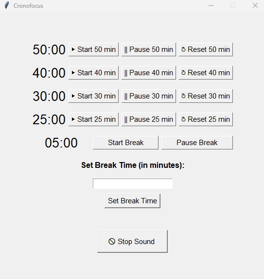
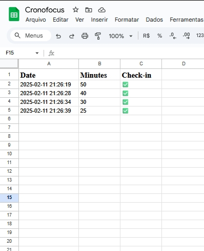

# 📌 **Cronofocus**  
⏳ A simple, minimalist and efficient Pomodoro timer to improve your productivity!  
<p align="center">
  
  
</p>

---

## 📚 **Table of Contents**
- [About the Project](#-about-the-project)
- [Features](#-features)
- [Technologies Used](#-technologies-used)
- [Project Structure](#-project-structure)
- [Installation and Running](#-installation-and-running)
- [Contribution](#-contribution)
- [License](#-license)
- [Author](#-author)


---

## 📌 About the Project
**Cronofocus** is a timer based on the Pomodoro technique, designed to help you stay focused and boost productivity. It allows you to alternate between work periods and breaks, ensuring that you maintain your energy throughout the day.
Additionally, Cronofocus integrates with the Google Sheets API, dynamically logging each completed Pomodoro session into a Google Sheets spreadsheet.

---

## 🚀 Features
- ✔️ Timers for 50, 40, 30 and 25 minute sessions 
- ✔️ Pop-up alerts when each cycle ends  
- ✔️ Simple and intuitive terminal interface
- ✔️ Integration with Google Sheets API: After each session ends, the timer dynamically updates the spreadsheet with details of the completed cycles.

---

## ⚙️ Technologies Used
- 🔹 **Language:** Python 3  
- 🔹 **Libraries:** `time`, `os`, `tkinter` (for pop-ups)  

---

## 📦 Project Structure

```
cronofocus
│── main.py        # Main code for the Pomodoro timer
│── README.md      # Project documentation
│── .gitignore     # Files and folders ignored by Git
│── venv/          # Python virtual environment (ignored by Git)
```

---

## 🛠️ Installation and Running

To run this application, you need to have the following installed:

- **Python 3.x**: Make sure you have Python 3.x installed.
- **Tkinter**: This is the library for building the GUI.
- **gspread**: To interact with Google Sheets.
- **google-auth**: For Google Sheets API authentication.
- **winsound**: To play sound notifications on Windows.

Install the necessary Python packages by running:

```bash
pip install gspread google-auth tkinter
```

### 1️⃣ Clone the Repository
```bash
git clone https://github.com/lucasfelipecastro/cronofocus.git
cd cronofocus
```

### 2️⃣ Create a Virtual Environment (Optional, but Recommended)
```bash
python -m venv venv
source venv/bin/activate  # Mac/Linux
venv\Scripts\Activate  # Windows
```

### 🔐 Setup

  1. Google Sheets API Setup:
        Follow the Google Sheets API quickstart guide to create a project, enable the Sheets API, and download the credentials.json file.
        Rename your downloaded credentials file to `credentials`.json and place it in the project directory (or modify the file path in the code).

  2. Google Sheets Configuration:
        Create a Google Sheet and copy its ID (found in the URL).
        Modify the spreadsheet = client.open_by_key('YOUR_SPREADSHEET_ID') line in the code with your own sheet ID.
     
  - The file path to the `gen-lang-client-0841060528-1f4635a8f204.json` should be updated to reflect where your credentials file is located. Make sure to include instructions for the user to adjust that path if necessary.

### 4️⃣ Run CronoFocus
```bash
python cronofocus.py
```

---

📌 You can customize the times by editing the code in `main.py`.  

---

## ✅ Contribution
Feel free to contribute with improvements! Just follow these steps:  
1. **Fork** this repository 🍴  
2. Create a new branch: `git checkout -b my-improvement`  
3. Make your changes and commit: `git commit -m "feat: My improvement"`  
4. Push to your fork: `git push origin my-improvement`  
5. Open a **Pull Request** 🚀  

---

## 📝 License
This project is licensed under the MIT License. See more details in the `LICENSE` file.  

---

## 👤 Author
**Lucas Felipe Castro de Santana**  
🏢 [LinkedIn](https://www.linkedin.com/in/lucasfelipecastro) | 🐱 [GitHub](https://github.com/lucasfelipecastro)
